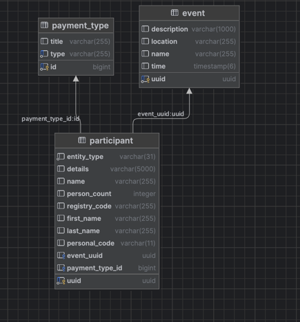

# Events App
Simple application to manage events and participants.

## How to run?

To run with Docker use 
```shell 
docker compose up -d
```

### Front-End
To run manually

```shell
yarn install
yarn dev
```

or build & run for production

```shell
yarn build
serve -S dist
```

### Back-End

To run manually
```shell
./gradlew :bootRun
```

## Technologies

Front-End:
* React with TypeScript
* Vite
* Bootstrap + Sass
* React Hook Forms
* React Router

Back-End:
* Spring Boot with Java
* Hibernate
* PostgreSQL for Database

## Tests

Use `./gradlew test` in initial directory to run tests.

## Entity Relations

